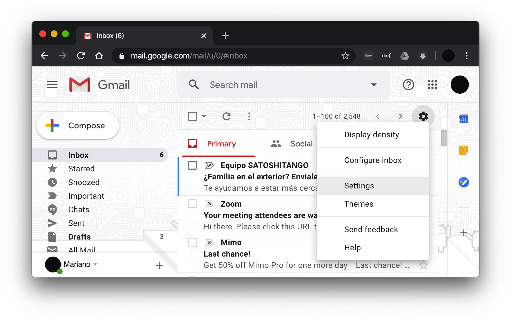
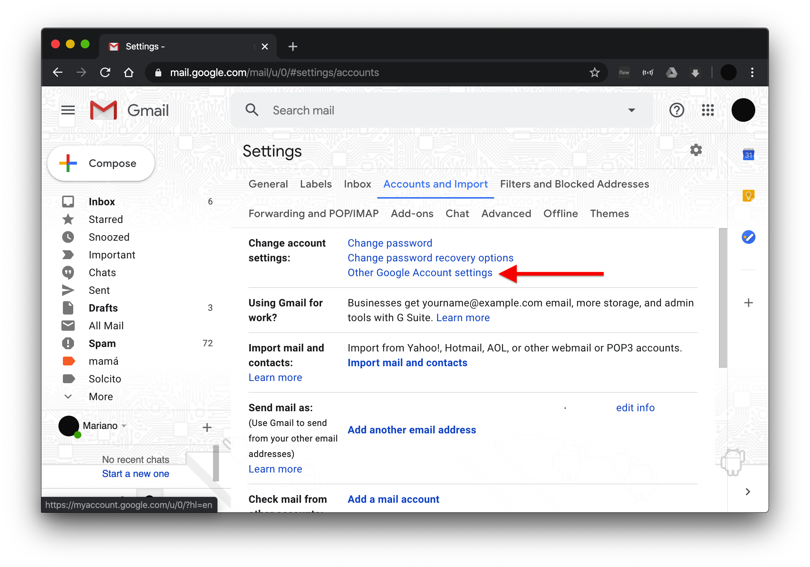
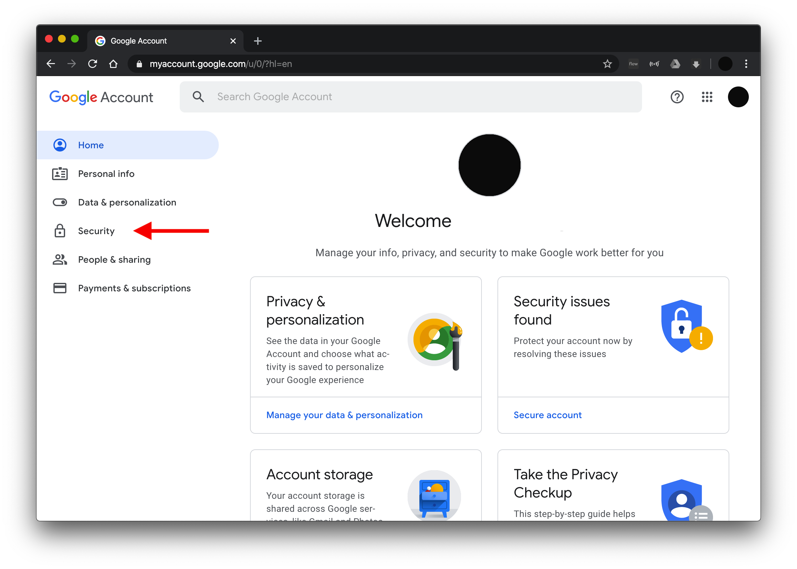
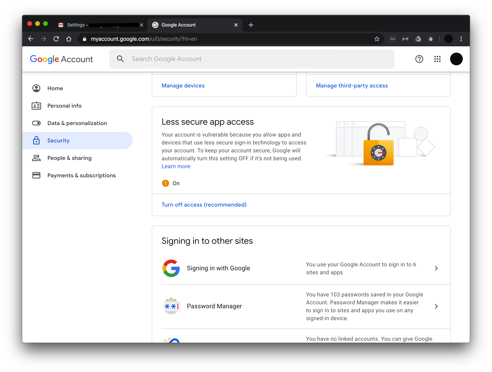

# Django + Gmail: configurar SMTP de Gmail en Django
#### por Mariano Belgrano, marzo 2020

## Instrucciones para configurar Django 3.0 para usar con Gmail en formularios de contacto

El procedimiento se divide en 3 partes:
1. Configurar Django
2. Configurar Gmail
3. Armado de backend

Este instructivo da por sentado conocimientos básicos de [Django](https://docs.djangoproject.com/es/3.0/) para generar un archivo html y enrutarlo.

<hr>

## Procedimiento

### 1. Configurar Django

Agregar a settings.txt lo siguiente:

```python
EMAIL_BACKEND = "django.core.mail.backends.smtp.EmailBackend"
EMAIL_HOST = "smtp.gmail.com"
EMAIL_PORT = 587
EMAIL_HOST_USER = "nuestroEmail"
EMAIL_HOST_PASSWORD = "nuestraClave"
EMAIL_USE_TLS = True
EMAIL_USE_SSL = False
```
Importante: Es recomendable colocar la clave en una variable de entorno y llamarla desde Django, en lugar de colocarla directamente en settings.txt

Quizás debemos cambiar el puerto por 465, poner en False TLS y en True SSL. TLS y SSL no pueden ser True simultáneamente.

### 2. Configurar Gmail

Activamos el acceso de apps externas:
Dentro de Gmail, vamos a "Configuración".



Dentro de la solapa "Cuentas e Importación". Cliqueamos en "Cambiar configuración de cuenta" cliqueamos en "Otras configuraciones de Cuenta Google".


Buscamos la opción "Seguridad".


Luego activamos la opción "Less Secure App Access" o su equivalente en español.


Nos van a llegar emails de Google advirtiéndonos sobre el riesgo de activar esta opción, que permite que apps externas usen la cuenta (por ejemplo para poder usar el cliente de correo Mozilla Thunderbird).

Una vez realizado esto, **debemos desbloquear el uso de Captcha** con el siguiente [link](https://accounts.google.com/DisplayUnlockCaptcha).

### 3. Armado de frontend y backend

Creamos una app "contact". (Algunos pasos propios de la creación y configuración de una app en Django los he salteado).

Armamos el formulario de esta manera en `contact.html`:
```html
<form action="" method="post">
    <div>
        <label for="email_name">Su nombre: </label>
        <input name="email_name" type="text" placeholder="Ingrese su nombre" size="30" autocomplete="off" autofocus>
    </div>
    <div>
        <label for="email_address">Su email:</label>
        <input name="email_address" type="email" placeholder="Su email" required autocomplete="off">
    </div>
        <label for="email_message">Mensaje</label>
        <textarea name="email_message" type="textarea" required></textarea>
    </div>
</form>
```

Y en el backend, en `contact/views.py`:

```python
from django.shortcuts import render
from django.core.mail import EmailMessage

def contact(request):
    if request.method == 'POST':
        email_name = request.POST["email_name"]
        email_address = request.POST["email_address"]
        email_message = request.POST["email_message"]
    
        email = EmailMessage(
            subject="Consulta", 
            body = f"{email_name} <{email_address}>\n{email_message}",
            from_email = email_address,
            to=['nuestroEmail'],
            reply_to=[email_address]
        )
        email.send(fail_silently=False)
        return render(request, 'contact/message_sent.html')
    return render(request, "contact/contact.html")
```
Reemplazar "nuestroEmail" por la dirección gmail a donde queramos recibir el correo. 

Observación. Por motivos de seguridad, los servidores de Gmail no permiten modificar la dirección de correo del remitente. La variable `from_email` sera entonces reemplazada por la configurada en `settings.txt` anteriormente. Sin embargo, la clase EmailMessage nos permite configurar un `reply_to` que usaremos para poder responder al remitente.

Para mayor configuraciones que permiten la clase EmailMessage, sus métodos y propiedades, sugiero leer la documentación oficial (disponible solo en inglés al momento de este tutorial).
> Ref: [Documentación oficial de Django](https://docs.djangoproject.com/en/3.0/topics/email/)

Por último, agregamos una página para avisarle al usuario que el mensaje fue enviado con éxito. En nuestro caso, se llama `message_sent.html`.


<hr>
 
[GitHub](https://github.com/marianojhb/django_smtp_gmail)